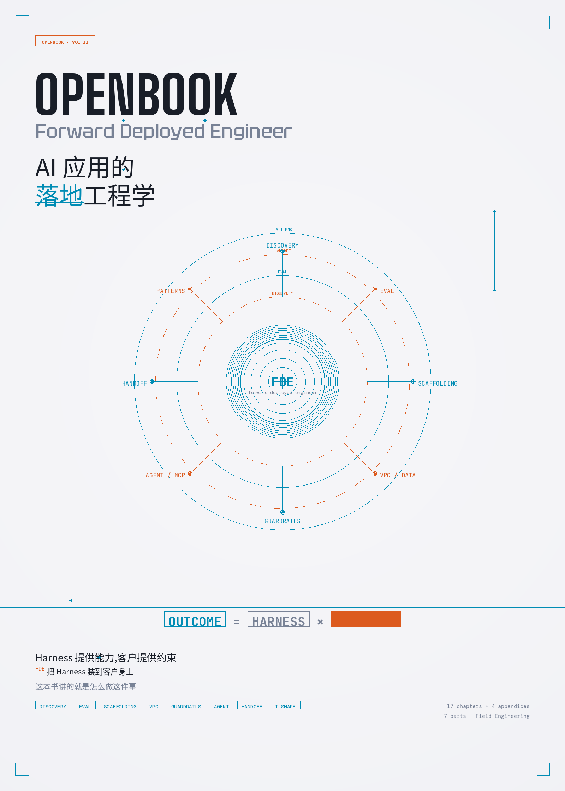

  

<h1 align="center">OpenBook: Forward Deployed Engineer</h1>
<h3 align="center">AI 应用的落地工程学</h3>

  <code>Outcome = Harness × Customer</code> — 这本书讲的是 Harness 怎么交到客户手里

  <code>Sell the outcome. Fix forward. Eval first.</code>

  <a href="en/README.md">English</a> ·
  <a href="https://dawei008.github.io/fde-book/">在线阅读</a> ·
  <a href="OpenBook-FDE-zh.pdf">中文 PDF</a> ·
  <a href="OpenBook-FDE-en.pdf">English PDF</a> ·
  <a href="bibliography.md">参考文献</a>

  <em>17 章 · 7 Part · 4 附录 · 中英双语</em>

---

> *本书是对 Forward Deployed Engineer 工程实践的独立梳理。所有引用均标注来源；不复制任何受版权保护的代码或长段原文。*

---

## 这是一本什么书

**这是写给已经在做或正要去做 FDE 的工程师的实用手册。**

不讲职业故事，不讲 FDE 的历史考据，不讲"是不是你的下一步"。

讲的是当你接到一个新客户、被丢到他们的会议室里、面对一堆 Confluence 文档和一个含糊的目标时，**第一周做什么、第六周做什么、第六个月做什么**，每一步具体的工程动作和判断。

它有两条主线并存：

- **LLM 应用主线**（Part III、VI 重点）：模型 / RAG / Agent / Eval / 工具集 — 2026 年大多数 FDE 在干的事
- **客户现场软件交付主线**（Part IV 重点）：Ontology / VPC 部署 / 集成 / 数据管道 — Palantir 风格的传统 FDE 工作

两条线在 Part II（Discovery）、Part V（PoC→生产）、Part VII（Handoff）合流。

---

## 你为什么需要这本书

如果你正在或即将面对下面任何一种情况：

- 老板让你"跟客户对接，把 PoC 推过线"，你不知道边界在哪里
- 第一次进客户的 VPC，被审批流、SSO、合规问卷拖住
- 写完一个 Demo 客户很满意，但说"上生产再聊"就再也没下文
- 接手一个上一任 FDE 留下的项目，文档残缺、Eval 没有、客户期待已经飘了
- Agent 跑得起来但客户不敢上 — 你不知道沙箱、回滚、可观测性怎么搭

这本书每一章都在直接回答这种问题。

---

## 目录速览

| Part | 适用 | 解决什么 |
|---|---|---|
| I 起手 | 通用 | FDE 工作流、三条铁律、两种形态如何切换 |
| II 客户发现 | 通用 | Discovery 实操、需求→评估集→SOW |
| III 脚手架 | LLM 主线 | 技术栈选型、决策树、Eval-driven 开发 |
| IV 数据与集成 | 现场交付主线 | Ontology、VPC、SSO、审计、遗留系统 |
| V PoC→生产 | 通用 | 过线条件、可观测性、灰度、回滚 |
| VI Agent 时代 | LLM 主线 | Agent 部署、工具沙箱、MCP 集成 |
| VII 交付与精进 | 通用 | Handoff、模式提取、T 字成长 |

完整章节见 [SUMMARY.md](SUMMARY.md)。

---

## 怎么读

- **从头到尾**：约 6-7 小时
- **只关心 LLM/Agent 应用**：Part I → III → V → VI → VII
- **只关心传统现场交付（数据 / 集成）**：Part I → II → IV → V → VII
- **当工具书查**：附录 A-D 按需翻

详见 [阅读指南](reading-guide.md)。

---

## 这本书不会做的事

- 不重述 Palantir 的发展史
- 不教 Python / SQL / Docker — 假设你已是 5 年以上工程师
- 不出版重复市面上的 LLM 教程 — 不讲"什么是 transformer"，讲"客户现场怎么选模型"
- 不堆 100 页"FDE 必读书单" — 该看的在每章末尾点名

---

## 状态

- 写作进行中（2026-05 启动）
- 中文是 source of truth；英文版镜像在 `en/`
- 研究素材和引用清单在 `research/` 目录，公开可查

如果你正在做 FDE 工作，欢迎在 GitHub Issue 里提具体问题或反例 — 可能成为下一版的章节。
