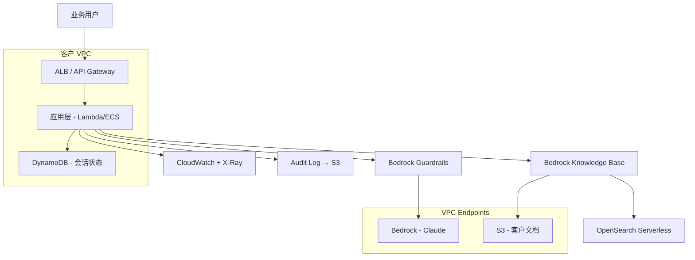

# 附录 D: 客户启动包 — 12 份第一周可用模板

> 接到一个新客户/新项目，第一周你需要的 12 份模板。每份给出"何时用 / 用法 / 模板正文"。
>
> 复制 → 改 → 用。

---

## 模板 1: Discovery 提纲 (访谈用)

**何时**: Kickoff 后 1-7 天
**对象**: 客户业务方 / IT / 安全各 1-2 人

```
  Discovery Interview — [客户名] / [访谈对象]
  日期:        2026-XX-XX
  访谈人:      [FDE 名]
  受访人:      [姓名 / 部门 / 职位]
  时长:        45 分钟

  ─────────── 业务背景 (10 min) ───────────
  Q1. 你们部门一天的核心工作流程是什么？
  Q2. 这个流程里目前最痛的点是什么？花你们多少人 / 多少时间？
  Q3. 你期待这个项目让什么变化发生？怎么衡量成功？

  ─────────── 数据 (10 min) ───────────
  Q4. 这件事涉及哪些数据？这些数据现在在哪？
  Q5. 数据是谁负责的？拿数据要走什么流程？
  Q6. 历史上有没有人尝试用这些数据做过相似事情？结果如何？

  ─────────── 技术 (10 min) ───────────
  Q7. 你们的 IT 栈是什么？(云 / 自有 / 混合)
  Q8. 现在已经有哪些 AI / ML / LLM 相关尝试？
  Q9. 这个项目有什么明确的技术约束？(必须 VPC / 必须开源 / 必须中文)

  ─────────── 合规与决策 (10 min) ───────────
  Q10. 这件事涉及哪些合规约束？(等保 / 数安 / 行业监管)
  Q11. 决策链是谁？谁批 prod 上线？
  Q12. 半年内有没有审计 / 检查计划？

  ─────────── 项目预期 (5 min) ───────────
  Q13. 你期待的时间线？
  Q14. 项目结束后谁来运营？
  Q15. 还有什么我们没问到但你想说的？
```

**FDE 自留笔记字段**:
```
  - 受访人对项目热情: 高 / 中 / 低
  - 是真正决策者还是传话人?
  - 提到了什么"不能做"的红线?
  - 提到了什么"上一次尝试失败"的故事?
```

---

## 模板 2: Discovery 总结报告

**何时**: Discovery 周结束
**对象**: 客户高层 + 项目组

```markdown
# [客户名] AI 项目 Discovery 报告
## 一、业务现状
- 当前流程图 (一页 A4)
- 痛点清单 (排序，量化损失)
- 现有尝试与教训

## 二、问题边界
- 我们要解决: …
- 我们不解决: … (写明)

## 三、数据现状
- 数据清单（表 + 字段 + 量级 + 更新频率）
- 数据可用性评估（红/黄/绿）
- 数据治理风险

## 四、技术约束
- 部署形态 (云/私有/离线)
- 必须用 / 不能用清单
- 安全合规要求

## 五、推荐方案 (2-3 个)
- 方案 A: 简单 / 快 / 6 周  覆盖 60% 用例
- 方案 B: 中等 / 12 周        覆盖 85% 用例
- 方案 C: 完整 / 20 周        覆盖 95% 用例

## 六、不可走的死路
- 路径 X — 原因
- 路径 Y — 原因

## 七、第一阶段 SOW 草案
- 范围
- 验收
- 里程碑
- 资源需求
```

---

## 模板 3: PoC SOW 骨架 (6-8 周)

```markdown
# Statement of Work — [项目名] PoC

## 1. 项目目的
[一句话: 验证 X 是否可行]

## 2. 范围 In-Scope
- 功能 A
- 功能 B
- 数据源 X (read-only)

## 3. 范围 Out-of-Scope (写明)
- 功能 C 不做
- 不接 SaaS Z
- 不做手机 APP

## 4. 交付物
- (1) PoC 应用 (可演示)
- (2) Eval 集 200 条 + 通过率报告
- (3) 架构图 + 部署文档
- (4) 复盘 + 后续路线图

## 5. 验收标准
- Eval 主指标 ≥ X%
- 单次响应延迟 P95 ≤ Y 秒
- 单次成本 ≤ Z 元
- 主要场景 5 个 demo 跑通

## 6. 时间线
W1: Discovery 收尾 + Eval 集 v0
W2-W3: 脚手架 + 第一版能跑
W4-W5: 迭代 + Eval 上分
W6: 验收 + Demo + 总结

## 7. 责任分工
- 客户: 业务专家 8h/周 + IT 4h/周 + 数据准备
- FDE: 全职 1 人

## 8. 假设与依赖
- AWS 账号 + 配额于 W1 前准备好
- VPC / 网络通路 D-3 前打通
- 数据样本 (脱敏) 于 W1 前可用

## 9. 变更管理
- 范围变更需双方书面确认
- 变更要重新评估时间线和价格

## 10. 价格
[依公司报价规则]
```

---

## 模板 4: Eval 集 v0 (jsonl 起手)

```jsonl
{"id":"E001","category":"core","input":{...},"expected":{"must_contain":["..."]},"metadata":{"difficulty":"easy","source":"业务专家"}}
{"id":"E002","category":"core","input":{...},"expected":{"must_contain":["..."]},"metadata":{"difficulty":"easy","source":"业务专家"}}
{"id":"E003","category":"edge","input":{...},"expected":{"must_not_contain":["免责"]},"metadata":{"difficulty":"medium"}}
{"id":"E004","category":"adversarial","input":{...},"expected":{"refuse":true},"metadata":{"difficulty":"hard"}}
```

**首日开口要的 5 件事**:
1. 业务专家手写 5-10 个最常见问题 + 期望答案
2. 5 个"如果系统答错就出大事"的反例
3. 5 个边界 case
4. 5 个对抗 case
5. 1 个判定标准说明（"什么叫答对"）

---

## 模板 5: 安全 / 合规问卷应答模板

**何时**: 客户安全部门发来"AI 安全调研问卷"

```
  常被问的 25 个问题 + 标准应答骨架
  ─────────────────────────────────────────

  Q1. 数据是否离开客户 VPC?
      A: 不离开. 模型推理走 VPC Endpoint, 日志走客户 S3 with KMS.

  Q2. 模型是否使用客户数据训练?
      A: Bedrock / Claude API 有数据隔离声明 (附 Anthropic / AWS 合同).

  Q3. PII 如何防泄漏?
      A: (1) Bedrock Guardrails sensitive info filter
         (2) 应用层 PII 扫描
         (3) 输出审计

  Q4. 谁能访问什么?
      A: IAM Identity Center + SCIM, 角色清单见 Doc 4.2

  Q5. 出问题怎么追溯?
      A: 全链路 trace_id, CloudTrail + Bedrock Logs + 应用 log
         保存 90 天 (可调到 7 年, KMS 加密)

  Q6. 如何防 prompt injection?
      A: Guardrails + 输入 sanitize + 工具 dry_run + HITL

  ... (略)
```

---

## 模板 6: 架构图 (Mermaid 起手)

```
  保存为 docs/architecture.md
  用 mermaid 生成, 客户审计时直接 export 成 PNG.
```



---

## 模板 7: 风险登记 (Risk Register)

```
  Risk Register — [项目名]
  更新于: 2026-XX-XX
  ─────────────────────────────────────────────

  ID | Risk                | 影响 | 概率 | 缓解 + Owner | 状态
  R1 | 数据交付延迟        | 高   | 中   | W1 升级 IT    | Open
  R2 | Bedrock 配额不足    | 中   | 高   | 提前申请      | Closed
  R3 | 业务专家时间不够    | 中   | 中   | 锁定 8h/周    | Open
  R4 | Guardrails 误杀      | 中   | 中   | Eval + 人审   | Open
  R5 | 客户无人接手 Handoff| 高   | 中   | T-3 周培训    | Open
```

---

## 模板 8: 周报模板

```markdown
# Week N 周报 — [项目名]
日期: 2026-XX-XX

## 本周做了什么
- [里程碑] 完成了 X
- [Eval] 主指标从 70% 提升到 78%
- [代码] 解决了 3 个 bug

## 主要数字
| 指标 | 上周 | 本周 | 目标 |
|---|---|---|---|
| Golden Eval 通过率 | 70% | 78% | ≥85% |
| 单次响应延迟 P95 | 4.2s | 3.1s | ≤3s |
| 单次平均成本 | $0.08 | $0.06 | ≤$0.05 |

## 下周计划
- 解决 Bedrock 限流 (R2)
- 跑 Adversarial 50 条
- 与客户业务专家 review

## 阻碍 / 需客户支持
- [紧急] 数据导出 X 表还没好 (Owner: 客户 IT, due: 周三)
- [一般] 等待安全部门审 IAM 角色

## 风险变化
- R3 提升到红色（业务专家本周只参与 4h）
```

---

## 模板 9: Runbook 骨架 (Handoff 前 3 周)

```markdown
# Runbook — [项目名]

## 1. 系统总览 (一页 A4)
- 架构图
- 主流程
- 关键依赖

## 2. 部署 / 回滚
### 2.1 正常部署
```bash
./scripts/deploy.sh prod --version=v1.2.3
```
### 2.2 回滚
```bash
./scripts/rollback.sh prod --target=v1.2.2
```

## 3. Top 10 故障 SOP
- SOP-001: 错误率突升 → ...
- SOP-002: 延迟突升 → ...
- SOP-003: 成本异常 → ...
- ...

## 4. Eval 怎么跑
```bash
python eval/run.py --set golden --output report.html
```
阈值: kw_match >= 0.95, semantic >= 0.80

## 5. 关键配置
- AppConfig: prompt_template_v3
- 模型 ID: us.anthropic.claude-3-5-sonnet-...
- KB ID: KB-XXXXX

## 6. 数据 / KB 更新 SOP
1. 上传到 S3: s3://docs/incoming/
2. 触发 sync: aws bedrock-agent start-ingestion-job ...
3. 跑 Eval 验证

## 7. Escalation
- L1 (客户运维): @ops-channel
- L2 (FDE on-call): +XX-XXXX-XXXX (24h)
- L3 (架构师): 仅紧急
```

---

## 模板 10: 验收清单 (双方签字)

```
  ─────────────────────────────────────────────
  [项目名] 验收单
  日期: 2026-XX-XX
  ─────────────────────────────────────────────

  □ 1. 功能验收 — 5 个 demo 场景全部跑通
       [✓] 场景 1: ...
       [✓] 场景 2: ...
       [✓] 场景 3: ...
       [✓] 场景 4: ...
       [✓] 场景 5: ...

  □ 2. 指标验收
       [✓] Golden Eval 通过率 ≥ 85%      实际: 88%
       [✓] P95 延迟 ≤ 3s                  实际: 2.4s
       [✓] 单次成本 ≤ $0.05               实际: $0.04

  □ 3. 合规验收
       [✓] PII 检查通过
       [✓] 审计日志完整
       [✓] 安全部门 sign-off

  □ 4. 文档验收
       [✓] 架构图
       [✓] Runbook
       [✓] Eval 报告
       [✓] 复盘 + 路线图

  □ 5. Handoff
       [✓] 培训完成 (4h, 3 人参加)
       [✓] 影子运营 5 天
       [✓] 客户 owner 已能独立 deploy / rollback

  ─────────────────────────────────────────────
  客户签字:               日期:
  FDE 签字:               日期:
  ─────────────────────────────────────────────
```

---

## 模板 11: 项目复盘模板 (1 周内写)

```markdown
# [项目名] 复盘 (内部)
日期: 2026-XX-XX
作者: [FDE]

## 一、做了什么
[一段话, 不要项目计划重复]

## 二、关键数字
- 时间: 计划 12w, 实际 13w
- 预算: $XX, 实际 $XX
- Eval: 主指标 88%
- 客户满意度: 4.5/5

## 三、做对了什么 (3 件)
1. W1 就把 Eval 集建好 → 全程没空转
2. 选了 Bedrock KB 不自建 → 省 4 周
3. T-3 开始 Handoff → 上线后 0 P1

## 四、做错了什么 (3 件)
1. W3 才发现 OAuth 流程要改 → 延期 1 周
2. 第一版 Agent 工具 35 个 → 准确率玄学, W7 削减到 12
3. 业务专家时间没锁 → W4-5 进度卡住

## 五、决策卡片 (3 个)
1. "客户问 X 怎么答" → ...
2. "Eval 卡线时优先做 Y" → ...
3. "出现 Z 信号马上回滚" → ...

## 六、可复用资产
- 代码: insurance-rag-starter v3.2
- 文档: 保险行业 Discovery 模板
- Eval: 保险问答 50 条 golden 模板

## 七、给下一个 FDE 的建议
- 接保险客户先看 [v3.2 模板]
- 等保三级问题不要绕，第一周直接面对
```

---

## 模板 12: 客户 Stakeholder Map

```
  Stakeholder Map — [客户名]
  ────────────────────────────────────────────────────

  决策圈 (decide)
    ★ CEO / VP — Sponsor — 季度过问 — 关心 ROI
    ★ CIO       — 决策   — 月度 review — 关心稳定 + 合规

  推动圈 (drive)
    ● 业务方 owner — 每周开会 — 关心业务效果
    ● 技术 lead    — 每周开会 — 关心架构 + 实施
    ● 安全主管    — 月度 + 关键节点 — 关心合规

  执行圈 (do)
    ○ 业务专家 (3 人) — 标 Eval / review 答案
    ○ 数据工程师 (2 人) — 数据交付
    ○ 应用工程师 (2 人) — 接客户内部系统

  关注圈 (informed)
    · 客服总监 — 关心上线影响
    · HR        — 关心人员流程变化

  ─────────────────────────────────────────────
  关键关系信号:
    - 业务方 owner ↔ 技术 lead 关系紧张? → 项目高风险
    - 安全主管什么时候首次 review? → 越早越好
    - Sponsor 是否真在意 (会议出席率)?
```

---

## 用法总结

```
  D-7      接到客户            → 模板 1 (Discovery 提纲)
  D-3      Discovery 收尾      → 模板 2 (总结报告)
  D-1      报价                  → 模板 3 (SOW)
  D+1      首次访谈 + 标注     → 模板 4 (Eval v0)
  W1       安全审查              → 模板 5 (问卷应答)
  W1       架构提交              → 模板 6 (Mermaid)
  W1       项目启动              → 模板 7 (风险登记) + 模板 12 (干系人)
  W2-W11   日常协作              → 模板 8 (周报)
  W9-W11   Handoff 准备          → 模板 9 (Runbook)
  W12      验收                  → 模板 10 (验收清单)
  W12+1    复盘                  → 模板 11 (复盘)
```

**全套 12 份纸面工作 ≈ 8-10 小时一次性建好**，用一辈子。

---

[← 返回目录](../README.md) · [全书结束 — 谢谢您看到这里]
