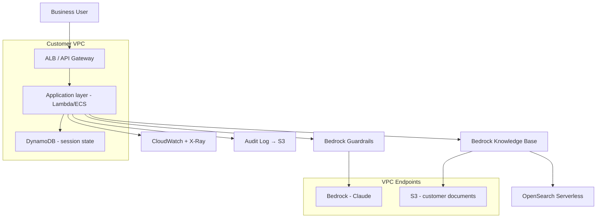

# Appendix D: Customer Onboarding Pack — 12 Templates Ready for Week One

> When you take on a new customer / new project, here are the 12 templates you'll need in week one. Each has "when to use / how to use / template body".
>
> Copy → edit → ship.

---

## Template 1: Discovery Outline (interview script)

**When**: Day 1-7 after kickoff
**Audience**: 1-2 people each from the customer's business / IT / security teams

```
  Discovery Interview — [Customer name] / [Interviewee]
  Date:        2026-XX-XX
  Interviewer: [FDE name]
  Interviewee: [Name / Department / Title]
  Duration:    45 minutes

  ─────────── Business Context (10 min) ───────────
  Q1. What is your team's core daily workflow?
  Q2. What's the most painful step in this flow today? How many people / hours does it cost?
  Q3. What change do you expect this project to bring? How will you measure success?

  ─────────── Data (10 min) ───────────
  Q4. Which datasets does this work touch? Where do they live today?
  Q5. Who owns those datasets? What's the process to obtain them?
  Q6. Has anyone tried to do something similar with this data before? Result?

  ─────────── Technical (10 min) ───────────
  Q7. What's your IT stack? (cloud / self-hosted / hybrid)
  Q8. What AI / ML / LLM efforts already exist?
  Q9. Are there explicit technical constraints? (must-VPC / must-OSS / must-Chinese)

  ─────────── Compliance and Decision (10 min) ───────────
  Q10. What compliance constraints apply? (industry regulation / data security)
  Q11. Who is the decision chain? Who signs off on prod launch?
  Q12. Any audit / inspection scheduled within six months?

  ─────────── Project Expectations (5 min) ───────────
  Q13. What timeline do you expect?
  Q14. Who will operate it after the project ends?
  Q15. Anything I haven't asked but you want to mention?
```

**FDE-only side notes**:
```
  - Interviewee enthusiasm for the project: high / medium / low
  - Real decision-maker, or messenger?
  - What "red lines" did they mention? (things that must not be done)
  - Did they mention a previous failed attempt? What's the story?
```

---

## Template 2: Discovery Summary Report

**When**: End of Discovery week
**Audience**: Customer leadership + project team

```markdown
# [Customer name] AI Project — Discovery Report

## I. Business as-is
- Current workflow diagram (one A4 page)
- Pain-point list (ranked, quantified loss)
- Existing attempts and lessons learned

## II. Problem boundary
- We will solve: …
- We will not solve: … (state it explicitly)

## III. Data as-is
- Dataset inventory (table + fields + magnitude + update cadence)
- Data availability assessment (red/yellow/green)
- Data governance risk

## IV. Technical constraints
- Deployment shape (cloud / private / offline)
- Must-use / must-not-use list
- Security and compliance requirements

## V. Recommended approaches (2-3)
- Plan A: Simple / fast / 6 weeks  Covers 60% of cases
- Plan B: Mid / 12 weeks            Covers 85% of cases
- Plan C: Full / 20 weeks           Covers 95% of cases

## VI. Dead ends to avoid
- Path X — reason
- Path Y — reason

## VII. Phase-1 SOW draft
- Scope
- Acceptance
- Milestones
- Resources required
```

---

## Template 3: PoC SOW Skeleton (6-8 weeks)

```markdown
# Statement of Work — [Project name] PoC

## 1. Project objective
[One sentence: validate whether X is feasible]

## 2. In-scope
- Feature A
- Feature B
- Data source X (read-only)

## 3. Out-of-scope (state explicitly)
- Feature C will not be built
- SaaS Z will not be integrated
- No mobile app

## 4. Deliverables
- (1) PoC application (demo-ready)
- (2) Eval set of 200 cases + pass-rate report
- (3) Architecture diagram + deployment doc
- (4) Retrospective + next-phase roadmap

## 5. Acceptance criteria
- Eval primary metric ≥ X%
- Single-call P95 latency ≤ Y seconds
- Single-call cost ≤ Z USD
- 5 main demo scenarios all working

## 6. Timeline
W1: Discovery wrap-up + Eval set v0
W2-W3: Scaffolding + first version running
W4-W5: Iteration + Eval improvement
W6: Acceptance + Demo + Wrap-up

## 7. Responsibilities
- Customer: business expert 8h/week + IT 4h/week + data prep
- FDE: 1 person full-time

## 8. Assumptions and dependencies
- AWS account + quota provisioned before W1
- VPC / network connectivity in place 3 days before kickoff
- Sample data (de-identified) available before W1

## 9. Change management
- Scope changes require written approval from both sides
- Changes trigger re-estimation of timeline and price

## 10. Pricing
[Per company pricing rules]
```

---

## Template 4: Eval Set v0 (jsonl starter)

```jsonl
{"id":"E001","category":"core","input":{...},"expected":{"must_contain":["..."]},"metadata":{"difficulty":"easy","source":"business expert"}}
{"id":"E002","category":"core","input":{...},"expected":{"must_contain":["..."]},"metadata":{"difficulty":"easy","source":"business expert"}}
{"id":"E003","category":"edge","input":{...},"expected":{"must_not_contain":["excluded"]},"metadata":{"difficulty":"medium"}}
{"id":"E004","category":"adversarial","input":{...},"expected":{"refuse":true},"metadata":{"difficulty":"hard"}}
```

**Five things to ask for on day one**:
1. Business expert hand-writes 5-10 most-frequent questions + expected answers
2. 5 counter-examples ("if the system answers this wrong, it's a major incident")
3. 5 edge cases
4. 5 adversarial cases
5. 1 written acceptance-criteria spec ("what does a correct answer look like?")

---

## Template 5: Security / Compliance Questionnaire Response Template

**When**: Customer security team sends an "AI security questionnaire"

```
  25 commonly-asked questions + standard response skeleton
  ─────────────────────────────────────────

  Q1. Does data leave the customer VPC?
      A: It does not. Model inference goes via VPC Endpoint;
         logs go to customer S3 with KMS.

  Q2. Is customer data used to train the model?
      A: Bedrock / Claude API has data isolation guarantees
         (Anthropic / AWS contractual clauses attached).

  Q3. How is PII protected from leakage?
      A: (1) Bedrock Guardrails sensitive-info filter
         (2) Application-layer PII scanning
         (3) Output audit

  Q4. Who can access what?
      A: IAM Identity Center + SCIM; role list in Doc 4.2.

  Q5. How do we trace incidents?
      A: End-to-end trace_id, CloudTrail + Bedrock Logs + application logs;
         retained 90 days (configurable up to 7 years, KMS encrypted).

  Q6. How do we defend against prompt injection?
      A: Guardrails + input sanitization + tool dry_run + HITL.

  ... (omitted)
```

---

## Template 6: Architecture Diagram (Mermaid starter)

```
  Save as docs/architecture.md.
  Generate with mermaid; export to PNG when the customer audits.
```



---

## Template 7: Risk Register

```
  Risk Register — [Project name]
  Updated: 2026-XX-XX
  ─────────────────────────────────────────────

  ID | Risk                   | Impact | Probability | Mitigation + Owner       | Status
  R1 | Data delivery delay    | High   | Mid         | Escalate to IT in W1      | Open
  R2 | Bedrock quota shortage | Mid    | High        | Request quota / evaluate Reserved tier | Closed
  R3 | Insufficient business expert time | Mid | Mid | Lock 8h/week              | Open
  R4 | Guardrails false positives | Mid | Mid        | Eval + human review       | Open
  R5 | No customer owner for handoff | High | Mid    | Begin training T-3 weeks  | Open
```

---

## Template 8: Weekly Report Template

```markdown
# Week N report — [Project name]
Date: 2026-XX-XX

## Done this week
- [Milestone] Completed X
- [Eval] Primary metric improved 70% → 78%
- [Code] Fixed 3 bugs

## Key numbers
| Metric | Last week | This week | Target |
|---|---|---|---|
| Golden Eval pass rate | 70% | 78% | ≥85% |
| Single-call P95 latency | 4.2s | 3.1s | ≤3s |
| Single-call avg cost | $0.08 | $0.06 | ≤$0.05 |

## Plan for next week
- Resolve Bedrock throttling (R2)
- Run 50 adversarial cases
- Review with customer business expert

## Blockers / Customer support needed
- [Urgent] Data export of table X is not ready (Owner: customer IT, due: Wednesday)
- [Normal] Awaiting security team's review of the IAM role

## Risk changes
- R3 escalated to red (business expert was only available 4h this week)
```

---

## Template 9: Runbook Skeleton (3 weeks before handoff)

```markdown
# Runbook — [Project name]

## 1. System overview (one A4 page)
- Architecture diagram
- Main flow
- Key dependencies

## 2. Deploy / rollback
### 2.1 Normal deploy
```bash
./scripts/deploy.sh prod --version=v1.2.3
```
### 2.2 Rollback
```bash
./scripts/rollback.sh prod --target=v1.2.2
```

## 3. Top-10 incident SOPs
- SOP-001: Error rate spike → ...
- SOP-002: Latency spike → ...
- SOP-003: Cost anomaly → ...
- ...

## 4. How to run eval
```bash
python eval/run.py --set golden --output report.html
```
Thresholds: kw_match >= 0.95, semantic >= 0.80

## 5. Key configuration
- AppConfig: prompt_template_v3
- Model ID: us.anthropic.claude-sonnet-4-5-... (use the version available in your primary region; include the cross-region inference prefix)
- KB ID: KB-XXXXX

## 6. Data / KB update SOP
1. Upload to S3: s3://docs/incoming/
2. Trigger sync: aws bedrock-agent start-ingestion-job ...
3. Run eval to validate

## 7. Escalation
- L1 (customer ops): @ops-channel
- L2 (FDE on-call): +XX-XXXX-XXXX (24h)
- L3 (architect): emergencies only
```

---

## Template 10: Acceptance Checklist (signed by both sides)

```
  ─────────────────────────────────────────────
  [Project name] Acceptance Form
  Date: 2026-XX-XX
  ─────────────────────────────────────────────

  □ 1. Functional acceptance — all 5 demo scenarios working
       [✓] Scenario 1: ...
       [✓] Scenario 2: ...
       [✓] Scenario 3: ...
       [✓] Scenario 4: ...
       [✓] Scenario 5: ...

  □ 2. Metric acceptance
       [✓] Golden Eval pass rate ≥ 85%      Actual: 88%
       [✓] P95 latency ≤ 3s                  Actual: 2.4s
       [✓] Single-call cost ≤ $0.05          Actual: $0.04

  □ 3. Compliance acceptance
       [✓] PII check passed
       [✓] Audit logs complete
       [✓] Security team sign-off

  □ 4. Documentation acceptance
       [✓] Architecture diagram
       [✓] Runbook
       [✓] Eval report
       [✓] Retrospective + roadmap

  □ 5. Handoff
       [✓] Training completed (4h, 3 attendees)
       [✓] Shadow operation 5 days
       [✓] Customer owner can independently deploy / rollback

  ─────────────────────────────────────────────
  Customer signature:           Date:
  FDE signature:                Date:
  ─────────────────────────────────────────────
```

---

## Template 11: Project Retrospective Template (write within 1 week)

```markdown
# [Project name] Retrospective (internal)
Date: 2026-XX-XX
Author: [FDE]

## I. What we did
[One paragraph; do not duplicate the project plan]

## II. Key numbers
- Time: planned 12w, actual 13w
- Budget: $XX, actual $XX
- Eval: primary metric 88%
- Customer satisfaction: 4.5/5

## III. Three things we did right
1. Built the eval set in W1 → no idle running throughout
2. Chose Bedrock KB over building our own → saved 4 weeks
3. Started handoff at T-3 → 0 P1 incidents post-launch

## IV. Three things we did wrong
1. Discovered the OAuth flow needed changing only in W3 → 1-week slip
2. First Agent had 35 tools → accuracy was a coin flip; cut to 12 in W7
3. Did not lock business expert time → progress stuck in W4-5

## V. Three decision cards
1. "What to say when the customer asks X" → ...
2. "When eval is stuck, prioritize Y" → ...
3. "When signal Z appears, roll back immediately" → ...

## VI. Reusable assets
- Code: insurance-rag-starter v3.2
- Docs: insurance-industry Discovery template
- Eval: insurance-Q&A 50-case golden template

## VII. Advice for the next FDE
- For an insurance customer, start from the [v3.2 template]
- Don't dodge industry-specific compliance issues; face them head-on in week one
```

---

## Template 12: Customer Stakeholder Map

```
  Stakeholder Map — [Customer name]
  ────────────────────────────────────────────────────

  Decide circle (decide)
    ★ CEO / VP — Sponsor — quarterly check-in — cares about ROI
    ★ CIO       — decision — monthly review     — cares about stability + compliance

  Drive circle (drive)
    ● Business owner — weekly sync — cares about business outcome
    ● Tech lead      — weekly sync — cares about architecture + delivery
    ● Security head  — monthly + key checkpoints — cares about compliance

  Do circle (do)
    ○ Business experts (3) — label eval / review answers
    ○ Data engineers (2)   — data delivery
    ○ App engineers (2)    — connect to internal customer systems

  Informed circle (informed)
    · Customer support director — cares about launch impact
    · HR                        — cares about staffing-process changes

  ─────────────────────────────────────────────
  Key relationship signals:
    - Business owner ↔ Tech lead relationship tense? → high project risk
    - When does the security head first review? → the earlier the better
    - Does the Sponsor actually care (meeting attendance rate)?
```

---

## Usage Summary

```
  D-7      Customer onboarding         → Template 1 (Discovery outline)
  D-3      Discovery wrap-up           → Template 2 (Summary report)
  D-1      Pricing                      → Template 3 (SOW)
  D+1      First interview + labeling   → Template 4 (Eval v0)
  W1       Security review              → Template 5 (questionnaire response)
  W1       Architecture submission      → Template 6 (Mermaid)
  W1       Project kickoff              → Template 7 (risk register) + Template 12 (stakeholder map)
  W2-W11   Daily collaboration          → Template 8 (weekly report)
  W9-W11   Handoff prep                 → Template 9 (Runbook)
  W12      Acceptance                   → Template 10 (acceptance checklist)
  W12+1    Retrospective                → Template 11 (retrospective)
```

**The full 12-piece paperwork ≈ 8-10 hours, built once, used for life.**

---

[← Back to Contents](../../README/) · [End of book — Thank you for reading]
