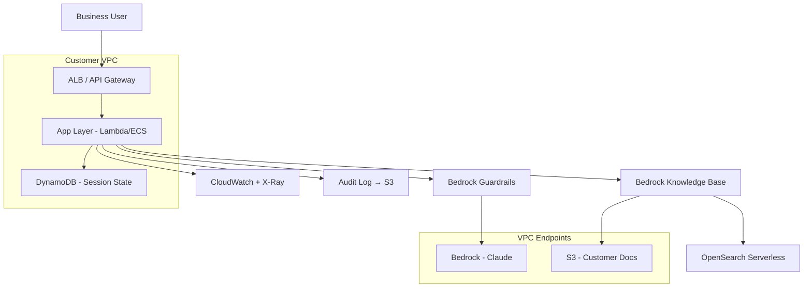

# Appendix D: Customer Kickoff Pack — 12 Templates Ready for Week One

> When you take on a new customer or new project, here are the 12 templates you'll need in week one. Each one comes with "when to use / how to use / template body."
>
> Copy → adapt → use.

---

## Template 1: Discovery Outline (for interviews)

**When**: 1-7 days after kickoff
**Audience**: 1-2 people each from customer business / IT / security

```
  Discovery Interview — [Customer] / [Interviewee]
  Date:           2026-XX-XX
  Interviewer:    [FDE name]
  Interviewee:    [Name / dept / title]
  Duration:       45 minutes

  ─────────── Business background (10 min) ───────────
  Q1. What does your team's daily core workflow look like?
  Q2. What is the most painful point in this workflow today? How many people / how much time?
  Q3. What change do you expect this project to deliver? How will you measure success?

  ─────────── Data (10 min) ───────────
  Q4. What data is involved? Where does it live today?
  Q5. Who owns the data? What's the process to obtain it?
  Q6. Has anyone tried to do something similar with this data in the past? How did it go?

  ─────────── Technology (10 min) ───────────
  Q7. What's your IT stack? (cloud / on-prem / hybrid)
  Q8. What AI / ML / LLM efforts already exist?
  Q9. Are there explicit technical constraints? (must be in-VPC / must be open-source / must support Chinese)

  ─────────── Compliance and decision-making (10 min) ───────────
  Q10. What compliance constraints are involved? (DJCP / data security law / sector regulators)
  Q11. Who is in the decision chain? Who signs off on the production launch?
  Q12. Any audits / inspections planned in the next six months?

  ─────────── Project expectations (5 min) ───────────
  Q13. What timeline do you expect?
  Q14. Who will operate this after the project ends?
  Q15. Anything we haven't asked but you want to mention?
```

**FDE private-notes fields**:
```
  - Interviewee's enthusiasm for the project: high / medium / low
  - Real decision-maker, or messenger?
  - What "we cannot do this" red lines did they mention?
  - Any "last attempt that failed" stories?
```

---

## Template 2: Discovery Summary Report

**When**: end of Discovery week
**Audience**: customer leadership + project team

```markdown
# [Customer] AI Project Discovery Report
## I. Business state today
- Current workflow diagram (one A4 page)
- Pain-point list (ranked, quantified loss)
- Prior attempts and lessons

## II. Problem boundaries
- We will solve: …
- We will not solve: … (state explicitly)

## III. Data state
- Data inventory (table + fields + scale + update frequency)
- Data availability assessment (red / yellow / green)
- Data governance risks

## IV. Technical constraints
- Deployment shape (cloud / private / offline)
- Must-use / cannot-use list
- Security and compliance requirements

## V. Recommended approaches (2-3)
- Option A: simple / fast / 6 weeks   covers 60% of cases
- Option B: medium / 12 weeks         covers 85% of cases
- Option C: complete / 20 weeks        covers 95% of cases

## VI. Dead ends to avoid
- Path X — reason
- Path Y — reason

## VII. Phase-1 SOW draft
- Scope
- Acceptance
- Milestones
- Resource needs
```

---

## Template 3: PoC SOW Skeleton (6-8 weeks)

```markdown
# Statement of Work — [Project] PoC

## 1. Project purpose
[One sentence: validate whether X is feasible]

## 2. Scope — In-Scope
- Feature A
- Feature B
- Data source X (read-only)

## 3. Scope — Out-of-Scope (state explicitly)
- Feature C is excluded
- No SaaS Z integration
- No mobile app

## 4. Deliverables
- (1) PoC application (demo-ready)
- (2) 200-case Eval set + pass-rate report
- (3) Architecture diagram + deployment docs
- (4) Retrospective + follow-on roadmap

## 5. Acceptance criteria
- Eval headline metric ≥ X%
- Single-response P95 latency ≤ Y seconds
- Cost per call ≤ Z RMB
- 5 main demo scenarios all pass

## 6. Timeline
W1: Discovery wrap-up + Eval set v0
W2-W3: Scaffold + first runnable version
W4-W5: Iterate + raise Eval scores
W6: Acceptance + Demo + summary

## 7. Responsibilities
- Customer: SMEs 8h/week + IT 4h/week + data preparation
- FDE: 1 person full-time

## 8. Assumptions and dependencies
- AWS account + quota ready by W1
- VPC / network paths opened by D-3
- Data sample (de-identified) available by W1

## 9. Change management
- Scope changes require written confirmation from both sides
- Changes trigger re-estimation of timeline and price

## 10. Pricing
[Per company pricing rules]
```

---

## Template 4: Eval Set v0 (jsonl starter)

```jsonl
{"id":"E001","category":"core","input":{...},"expected":{"must_contain":["..."]},"metadata":{"difficulty":"easy","source":"SME"}}
{"id":"E002","category":"core","input":{...},"expected":{"must_contain":["..."]},"metadata":{"difficulty":"easy","source":"SME"}}
{"id":"E003","category":"edge","input":{...},"expected":{"must_not_contain":["excluded"]},"metadata":{"difficulty":"medium"}}
{"id":"E004","category":"adversarial","input":{...},"expected":{"refuse":true},"metadata":{"difficulty":"hard"}}
```

**The 5 things to ask for on day one**:
1. SME hand-writes 5-10 most-common questions + expected answers
2. 5 counterexamples ("if the system gets these wrong, something blows up")
3. 5 edge cases
4. 5 adversarial cases
5. 1 written judgment-criteria spec ("what counts as correct")

---

## Template 5: Security / Compliance Questionnaire Response Template

**When**: customer security team sends an "AI Security Survey"

```
  25 frequently-asked questions + skeleton answers
  ─────────────────────────────────────────

  Q1. Does data leave the customer VPC?
      A: It does not. Model inference goes through a VPC Endpoint; logs go to the customer's S3 with KMS.

  Q2. Is customer data used to train models?
      A: Bedrock / Claude API have data isolation statements (see Anthropic / AWS contracts).

  Q3. How is PII protected from leakage?
      A: (1) Bedrock Guardrails sensitive-info filter
         (2) Application-layer PII scanning
         (3) Output auditing

  Q4. Who can access what?
      A: IAM Identity Center + SCIM; role list in Doc 4.2.

  Q5. How are issues traced?
      A: End-to-end trace_id, CloudTrail + Bedrock Logs + application logs
         retained 90 days (configurable up to 7 years, KMS-encrypted).

  Q6. How is prompt injection defended?
      A: Guardrails + input sanitization + tool dry_run + HITL.

  ... (truncated)
```

---

## Template 6: Architecture Diagram (Mermaid starter)

```
  Save as docs/architecture.md.
  Generate with mermaid; export to PNG directly during customer audits.
```



---

## Template 7: Risk Register

```
  Risk Register — [Project]
  Updated: 2026-XX-XX
  ─────────────────────────────────────────────

  ID | Risk                       | Impact | Probability | Mitigation + Owner | Status
  R1 | Data delivery delayed       | High   | Med         | W1 escalate to IT  | Open
  R2 | Bedrock quota insufficient  | Med    | High        | Pre-request        | Closed
  R3 | SME bandwidth too low       | Med    | Med         | Lock 8h/week       | Open
  R4 | Guardrails false positives  | Med    | Med         | Eval + human review| Open
  R5 | No customer owner for handoff| High  | Med         | Train at T-3 weeks | Open
```

---

## Template 8: Weekly Report Template

```markdown
# Week N Report — [Project]
Date: 2026-XX-XX

## What we did this week
- [Milestone] Completed X
- [Eval] Headline metric improved from 70% to 78%
- [Code] Fixed 3 bugs

## Headline numbers
| Metric | Last week | This week | Target |
|---|---|---|---|
| Golden Eval pass rate | 70% | 78% | ≥85% |
| P95 single-response latency | 4.2s | 3.1s | ≤3s |
| Average cost per call | $0.08 | $0.06 | ≤$0.05 |

## Plan for next week
- Resolve Bedrock throttling (R2)
- Run 50 Adversarial cases
- Review with customer SMEs

## Blockers / customer support needed
- [Urgent] Data export for table X is not yet ready (Owner: customer IT, due Wed)
- [Standard] Awaiting security team's IAM-role review

## Risk changes
- R3 elevated to red (SME participated only 4h this week)
```

---

## Template 9: Runbook Skeleton (3 weeks before Handoff)

```markdown
# Runbook — [Project]

## 1. System overview (one A4 page)
- Architecture diagram
- Main flow
- Key dependencies

## 2. Deploy / rollback
### 2.1 Normal deploy
```bash
./scripts/deploy.sh prod --version=v1.2.3
```
### 2.2 Rollback
```bash
./scripts/rollback.sh prod --target=v1.2.2
```

## 3. Top-10 incident SOPs
- SOP-001: Error rate spikes → ...
- SOP-002: Latency spikes → ...
- SOP-003: Cost anomaly → ...
- ...

## 4. How to run Evals
```bash
python eval/run.py --set golden --output report.html
```
Thresholds: kw_match >= 0.95, semantic >= 0.80

## 5. Key configuration
- AppConfig: prompt_template_v3
- Model ID: us.anthropic.claude-3-5-sonnet-...
- KB ID: KB-XXXXX

## 6. Data / KB update SOP
1. Upload to S3: s3://docs/incoming/
2. Trigger sync: aws bedrock-agent start-ingestion-job ...
3. Run Eval to verify

## 7. Escalation
- L1 (customer ops): @ops-channel
- L2 (FDE on-call): +XX-XXXX-XXXX (24h)
- L3 (architect): emergency only
```

---

## Template 10: Acceptance Checklist (signed by both sides)

```
  ─────────────────────────────────────────────
  [Project] Acceptance Sheet
  Date: 2026-XX-XX
  ─────────────────────────────────────────────

  □ 1. Functional acceptance — all 5 demo scenarios pass
       [✓] Scenario 1: ...
       [✓] Scenario 2: ...
       [✓] Scenario 3: ...
       [✓] Scenario 4: ...
       [✓] Scenario 5: ...

  □ 2. Metric acceptance
       [✓] Golden Eval pass rate ≥ 85%   actual: 88%
       [✓] P95 latency ≤ 3s               actual: 2.4s
       [✓] Cost per call ≤ $0.05          actual: $0.04

  □ 3. Compliance acceptance
       [✓] PII check passed
       [✓] Audit logs complete
       [✓] Security team sign-off

  □ 4. Documentation acceptance
       [✓] Architecture diagram
       [✓] Runbook
       [✓] Eval report
       [✓] Retrospective + roadmap

  □ 5. Handoff
       [✓] Training complete (4h, 3 attendees)
       [✓] Shadow operations 5 days
       [✓] Customer owner can deploy / rollback independently

  ─────────────────────────────────────────────
  Customer signature:               Date:
  FDE signature:                    Date:
  ─────────────────────────────────────────────
```

---

## Template 11: Project Retrospective Template (write within 1 week)

```markdown
# [Project] Retrospective (internal)
Date: 2026-XX-XX
Author: [FDE]

## I. What we did
[One paragraph — do not repeat the project plan]

## II. Headline numbers
- Time: planned 12w, actual 13w
- Budget: $XX, actual $XX
- Eval: headline metric 88%
- Customer satisfaction: 4.5/5

## III. What went right (3 things)
1. Built the Eval set in W1 → no idle spinning all the way through
2. Chose Bedrock KB over building our own → saved 4 weeks
3. Started Handoff at T-3 → 0 P1s after launch

## IV. What went wrong (3 things)
1. OAuth flow change wasn't surfaced until W3 → 1-week slip
2. First-version Agent had 35 tools → accuracy chaos; trimmed to 12 by W7
3. Did not lock SME bandwidth → progress stalled in W4-5

## V. Decision cards (3)
1. "When the customer asks X, answer Y" → ...
2. "When Eval is on the line, prioritize Y" → ...
3. "When signal Z appears, roll back immediately" → ...

## VI. Reusable assets
- Code: insurance-rag-starter v3.2
- Docs: Insurance industry Discovery template
- Eval: 50-case golden template for insurance QA

## VII. Advice for the next FDE
- For insurance customers, start from the [v3.2 template]
- Don't dance around DJCP-3 questions; face them in week one
```

---

## Template 12: Customer Stakeholder Map

```
  Stakeholder Map — [Customer]
  ────────────────────────────────────────────────────

  Decide circle
    ★ CEO / VP — Sponsor — quarterly check-in — cares about ROI
    ★ CIO       — Decider — monthly review    — cares about stability + compliance

  Drive circle
    ● Business owner   — weekly meeting — cares about business outcomes
    ● Tech lead        — weekly meeting — cares about architecture + delivery
    ● Security lead    — monthly + key milestones — cares about compliance

  Do circle
    ○ SMEs (3 people)              — annotate Evals / review answers
    ○ Data engineers (2 people)    — data delivery
    ○ App engineers (2 people)     — integrate customer internal systems

  Informed circle
    · Customer service director — cares about launch impact
    · HR                        — cares about staffing / process changes

  ─────────────────────────────────────────────
  Key relationship signals:
    - Tension between business owner ↔ tech lead? → high project risk
    - When does the security lead first review? → the earlier the better
    - Is the Sponsor actually engaged (meeting attendance rate)?
```

---

## Usage Summary

```
  D-7      Take on the customer            → Template 1 (Discovery outline)
  D-3      Discovery wrap-up               → Template 2 (Summary report)
  D-1      Pricing                         → Template 3 (SOW)
  D+1      First interviews + annotation   → Template 4 (Eval v0)
  W1       Security review                 → Template 5 (Questionnaire response)
  W1       Architecture submission         → Template 6 (Mermaid)
  W1       Project kickoff                 → Template 7 (Risk register) + Template 12 (Stakeholders)
  W2-W11   Daily collaboration             → Template 8 (Weekly report)
  W9-W11   Handoff prep                    → Template 9 (Runbook)
  W12      Acceptance                      → Template 10 (Checklist)
  W12+1    Retrospective                   → Template 11 (Retro)
```

**The whole 12-template paperwork pack ≈ 8-10 hours to build once**, and you reuse it for the rest of your career.

---

[← Back to Contents](../README.md) · [End of book — thank you for reading this far]
